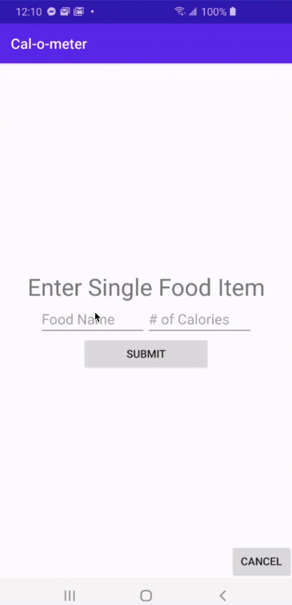
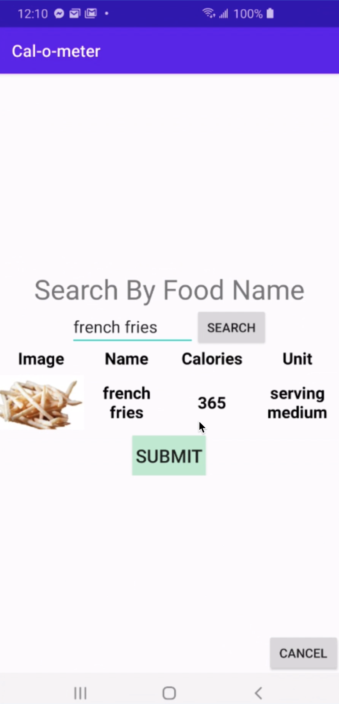
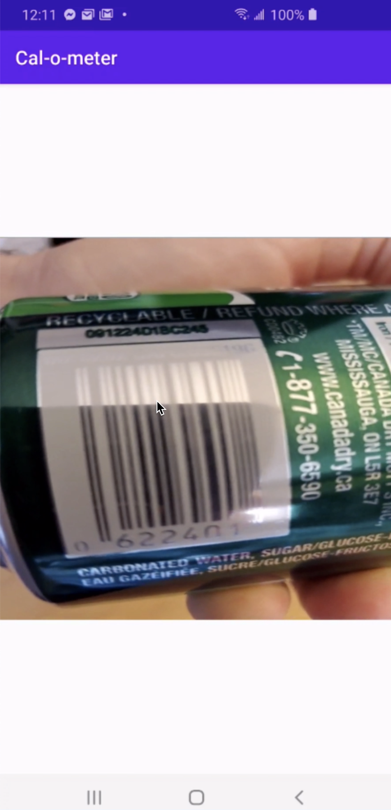
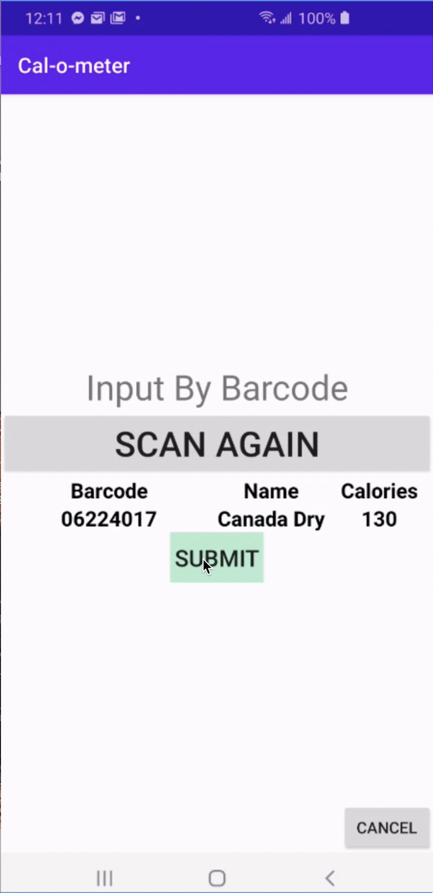
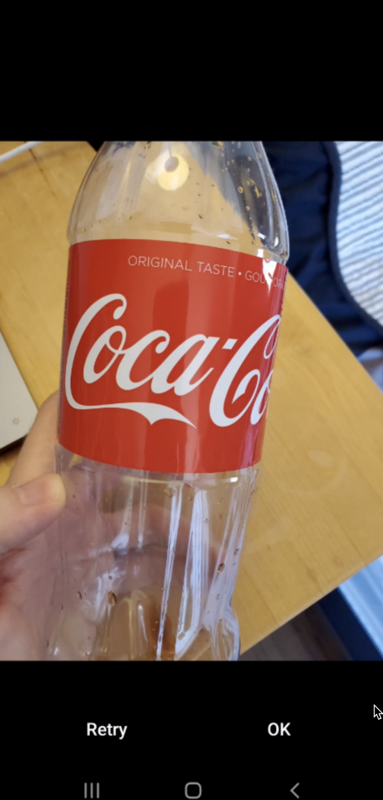
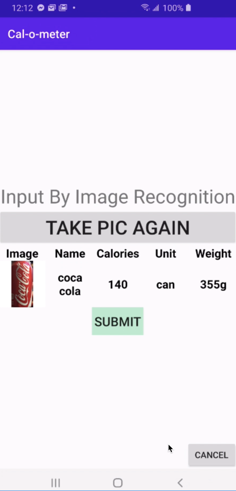
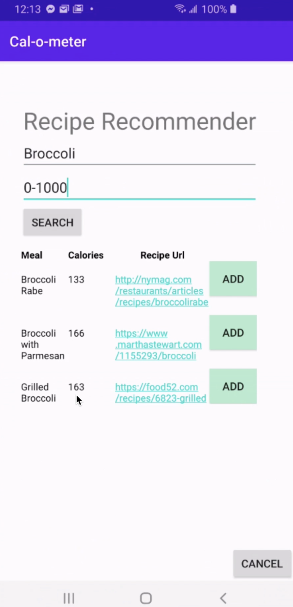
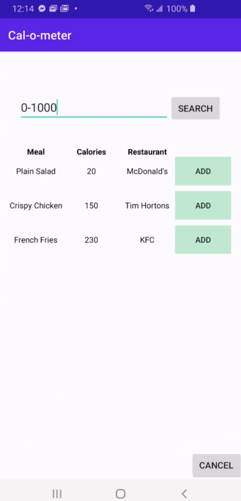

# Cal-O-Meter
Cal-O-Meter is a calorie counter android app which allows users to plan/track their meals and caloric intake, as well as find recipes and local restaurants according to their dietary needs. This was implemented using Firebase (Authentication, Firestore, Cloud Functions), GCP Vision API, Nutritionix API, and EDAMAM Recipe Search API, and Google's Android barcode scanning library. 
 
 
Checkout the demo below: 
 
 

 
https://www.youtube.com/watch?v=0Rc-3NSIlHU
 
 
 
The user can input meals in the following ways:  
1.Single Food Item:
   
  <table>
    <tr>
      -Manual Input
    </tr>
    <tr>
      <table>
        <tr>
          <td>
            
          </td>
        </tr>
      </table>
    </tr>
    <tr>
      -Search By Name
    </tr>
    <tr>
      <table>
        <tr>
          <td>
            
          </td>
        </tr>
      </table>
    </tr>
    <tr>
      -Scan Barcode
    </tr>
    <tr>
      <table>
        <tr>
          <td>
            
          </td>
          <td>
            
          </td>
        </tr>
      </table>
    </tr>
    <tr>
      -Take Picture
    </tr>
    <tr>
      <table>
        <tr>
          <td>
            
          </td>
          <td>
            
          </td>
        </tr>
      </table>
  </table>
2.Search for recipes within a caloric range given ingredients (using EDAMAM Recipe Search API)
   
      <table>
        <tr>
          <td>
            
          </td>
        </tr>
      </table>
3.Search for local restaurants that have meals within a caloric range (querying Firestore database)
   
      <table>
        <tr>
          <td>
            
          </td>
        </tr>
      </table>
 
 
 
Since this is the public version, the repo does not contain the settings json files for the Firebase project or for the cloudfunctions code. Also the API keys for the GCP Vision API, Nutritionix API, and EDAMAM API have been removed.
